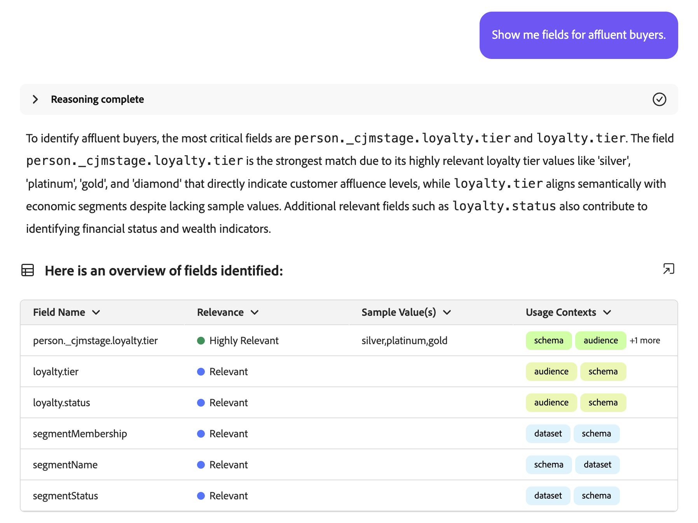
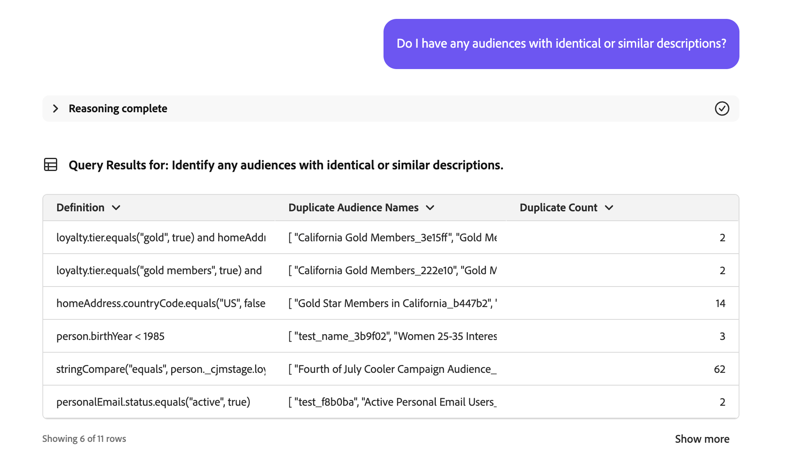

# Audience Agent

>[!AVAILABILITY]
>
>O Audience Agent está disponível para todos os clientes que têm acesso ao AI Assistant. No entanto, você precisará das seguintes permissões para usar totalmente os recursos do Audience Agent.
>
>**Exibir segmentos**: essa permissão permite que você use a Audience Agent para exibir insights sobre os públicos diretamente no Assistente de IA.
>
>**Gerenciar segmentos**: a permissão Para permite que você use a Audience Agent para criar novos públicos diretamente no Assistente de IA.

O Audience Agent permite exibir insights sobre públicos-alvo, incluindo a detecção de alterações significativas no tamanho do público-alvo, a detecção de públicos-alvo duplicados, a exploração do inventário do público-alvo e a recuperação do tamanho deles.

## Casos de uso compatíveis

O Audience Agent no Assistente de IA é compatível com os seguintes casos de uso:

- Encontre o tamanho do seu público e detecte alterações significativas no tamanho do público

   - Isso permite encontrar públicos que subitamente cresceram ou diminuíram, permitindo que você analise melhor as possíveis alterações de mercado

- Detectar públicos-alvo duplicados

   - Isso permite reduzir as redundâncias com os públicos criados

- Encontre públicos-alvo com base em atributos completos ou parciais chamados

   - Isso facilita a navegação pelo inventário de público-alvo

- Descobrir campos XDM que podem ser usados para definir um público

   - Essa habilidade permite identificar mais facilmente os campos certos a serem usados no público com base no contexto e na relevância

A Audience Agent não **oferece suporte atualmente** aos seguintes recursos:

- Criação de público-alvo com base no conhecimento

   - A criação de público-alvo com base no conhecimento é criar um público-alvo com base nos atributos e eventos fornecidos
   - Além disso, é possível estimar o tamanho potencial do público-alvo antes da criação. Isso permite iterar rapidamente no público-alvo mais eficiente antes que esteja pronto para ativação
   - O suporte para esse recurso será lançado em breve

- Exploração de público-alvo com base em metas

   - A exploração de público-alvo com base em metas permite descobrir conjuntos de dados e perfis relevantes alinhados a uma meta comercial aplicando modelos de aprendizado de máquina, como propensão para comprar ou converter.

Além disso, ao usar o Audience Agent, você deve ter as seguintes restrições em mente:

- O Audience Agent precisa de pelo menos 24 horas para processar seus dados

   - Por exemplo, você **não pode** ter uma consulta que procura dados nas últimas 24 horas. Você terá que olhar dentro das últimas 48 horas, no mínimo.

- O Audience Agent só oferece suporte a **pessoas**, com base em públicos avaliados por meio da segmentação em lote

## Exemplos de prompts

Os exemplos a seguir demonstram exemplos de prompts e respostas para a Audience Agent.

### Exploração de público-alvo de conversa

Mostre-me campos para compradores ricos.

+++ Resposta

+++

Quais públicos-alvo não foram ativados ou usados em nenhuma campanha nos últimos 30 dias?

+++ Resposta

+++

Liste todos os públicos que foram mapeados para novos destinos nos últimos três meses.

+++ Resposta

+++

### Detectar públicos-alvo duplicados

Tenho públicos-alvo com descrições idênticas ou semelhantes?

+++ Resposta

+++

Identifique públicos que tenham as mesmas regras, mas nomes diferentes.

+++ Resposta

+++

Mostre-me todos os públicos-alvo que têm as mesmas regras, mas destinos de ativação diferentes.

+++ Resposta

+++

### Recuperar tamanho do público

Qual é o tamanho atual do meu público-alvo &quot;Membros Gold-star na Califórnia_f153e1&quot;?

+++ Resposta

+++

Qual é o meu maior público-alvo?

+++ Resposta

+++

### Detectar alterações significativas no tamanho do público

Quais públicos-alvo aumentaram de tamanho em mais de 20% na última semana?

+++ Resposta

+++

Quais públicos-alvo diminuíram em tamanho em mais de 10% no último mês?

+++ Resposta

+++

Qual é o meu público que cresce mais rápido?

+++ Resposta

+++

## Próximas etapas

Depois de ler este guia, você terá uma melhor compreensão do Audience Agent e de quais recursos ele oferece suporte. Para obter mais informações sobre agentes no Adobe Experience Platform, leia a [visão geral do Agent Orchestrator](./agent-orchestrator.md).

