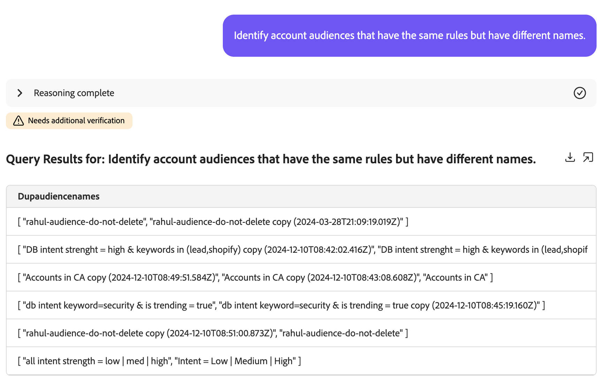

# Audience Agent

>[!AVAILABILITY]
>
>O Audience Agent está disponível para todos os clientes que têm acesso ao AI Assistant. No entanto, você precisará das seguintes permissões para usar totalmente os recursos do Audience Agent.
>
>**Exibir segmentos**: essa permissão permite que você use a Audience Agent para exibir insights sobre os públicos diretamente no Assistente de IA.
>
>**Gerenciar segmentos**: a permissão Para permite que você use a Audience Agent para criar novos públicos diretamente no Assistente de IA.

O Audience Agent permite exibir insights sobre públicos-alvo, incluindo a detecção de alterações significativas no tamanho do público-alvo, a detecção de públicos-alvo duplicados, a exploração do inventário do público-alvo e a recuperação do tamanho deles.

>[!SLIDE](audience-agent-overview)

## Casos de uso aceitos

O Audience Agent no Assistente de IA é compatível com os seguintes casos de uso:

- Explorar seu público de forma conversacional
   - Localizar tamanhos de público-alvo de públicos-alvo existentes
   - Procure públicos-alvo com base em atributos completos ou parciais chamados
   - Detectar públicos-alvo duplicados
   - Descobrir campos XDM que podem ser usados para definir um público
- Detectar alterações significativas no tamanho do público
   - Isso permite encontrar públicos que subitamente cresceram ou diminuíram, permitindo que você analise melhor as possíveis alterações de mercado
- Criação de público-alvo
   - Essa habilidade permite criar um público-alvo com base nos atributos e eventos fornecidos
   - Além disso, essa habilidade permite estimar o tamanho potencial de um público antes de criá-lo, permitindo que você repita rapidamente no público mais eficiente antes que ele esteja pronto para ser ativado

<!-- - Find your audience size and detect significant changes in audience size
  - This lets you find audiences that have suddenly grown or shrunk, letting you better analyze potential market changes
- Detect duplicate audiences
  - This lets you reduce redundancies with your created audiences
- Find audiences based on full or partial attributes named
  - This lets you more easily navigate through your audience inventory
- Discover XDM fields you can use to define an audience
  - This skill lets you more easily identify the right fields to use in your audience based on context and relevance -->

A Audience Agent não **oferece suporte ao seguinte recurso no momento**:

- Exploração de público-alvo com base em metas
   - A exploração de público-alvo com base em metas permite descobrir conjuntos de dados e perfis relevantes alinhados a uma meta comercial aplicando modelos de aprendizado de máquina, como propensão para comprar ou converter.

Além disso, ao usar o Audience Agent, você deve ter as seguintes restrições em mente:

- O Audience Agent precisa de pelo menos 24 horas para processar seus dados
   - Por exemplo, você **não pode** ter uma consulta que procura dados nas últimas 24 horas. Você terá que olhar dentro das últimas 48 horas, no mínimo.
- O Audience Agent é compatível apenas com os seguintes tipos de público-alvo:
   - **Públicos-alvo** com base em pessoas que são avaliados usando a segmentação em lote
   - **Públicos-alvo** baseados em conta para os seguintes casos de uso:
      - Exploração de público-alvo de conversa
      - Detecção de público-alvo duplicado

## Exemplos de prompts

Os exemplos a seguir demonstram exemplos de prompts e respostas para a Audience Agent.

### Exploração de público-alvo de conversa

Mostre-me campos para compradores ricos.

+++ Resposta


+++

Quais públicos-alvo não foram ativados ou usados em nenhuma campanha nos últimos 30 dias?

+++ Resposta


+++

Liste todos os públicos que foram mapeados para novos destinos nos últimos três meses.

+++ Resposta


+++

Qual público-alvo de conta tem o maior tamanho de público-alvo e qual é esse tamanho?

+++ Resposta


+++

### Detectar públicos-alvo duplicados

Tenho públicos-alvo com descrições idênticas ou semelhantes?

+++ Resposta


+++

Identifique públicos que tenham as mesmas regras, mas nomes diferentes.

+++ Resposta


+++

Mostre-me todos os públicos-alvo que têm as mesmas regras, mas destinos de ativação diferentes.

+++ Resposta


+++

Identifique públicos-alvo de conta que tenham as mesmas regras, mas nomes diferentes.

+++ Resposta



+++

### Recuperar tamanho do público

Qual é o tamanho atual do meu público-alvo &quot;Membros Gold-star na Califórnia_f153e1&quot;?

+++ Resposta


+++

Qual é o meu maior público-alvo?

+++ Resposta


+++

### Detectar alterações significativas no tamanho do público

Quais públicos-alvo aumentaram de tamanho em mais de 20% na última semana?

+++ Resposta


+++

Quais públicos-alvo diminuíram em tamanho em mais de 10% no último mês?

+++ Resposta


+++

Qual é o meu público que cresce mais rápido?

+++ Resposta


+++

### Criar um público-alvo

Ao criar um público-alvo com o Audience Agent, o Assistente de IA orientará você em um plano. Por exemplo, você pode pedir para &quot;Criar um público-alvo composto por pessoas que vivem na Califórnia&quot;. O Assistente de IA lista o plano que ele executará para criar o público-alvo.

+++ Resposta


+++

Este plano é composto por três etapas:

1. [Identificar características do público](#identify)
2. [Estimar tamanho do público](#estimate)
3. [Criar e criar um novo público-alvo persistente](#create)

#### Identificar características do público {#identify}

{align="center" width="80%"}

Depois de aceitar o plano, o Assistente de IA capturará as características do público-alvo com base na consulta inicial.

+++ Resposta


Para esta consulta, o Assistente de IA gera a Profile Query Language (PQL) relevante que procuraria pessoas que vivem na Califórnia. Nesse caso de uso, a consulta do PQL seria semelhante ao seguinte:

```sql
homeAddress.state.equals("California", false)
```

Para obter mais informações sobre o PQL, leia a [visão geral do PQL](https://experienceleague.adobe.com/en/docs/experience-platform/segmentation/pql/overview).

+++

Se a definição de público-alvo do Assistente de IA estiver correta, você poderá aprovar e seguir para a próxima etapa.

#### Estimar tamanho do público {#estimate}

{align="center" width="80%"}

Depois de aprovar as características identificadas do público-alvo, o Assistente de IA estimará o tamanho do público-alvo potencial e os detalhes de definição do público-alvo.

+++ Resposta


+++

Se o tamanho estimado estiver correto, você poderá aprovar e seguir para a próxima etapa.

#### Criar e manter um novo público-alvo {#create}

{align="center" width="80%"}

Por fim, se as características e o tamanho do público estiverem corretos, você poderá aprovar ou rejeitar a criação do público.

+++ Resposta

Primeiro, você pode revisar o público-alvo proposto por meio da grade de dados fornecida.


Se o público estiver correto, você pode aceitar a proposta selecionando **[!UICONTROL Criar]** para concluir a criação do público.


+++

O público-alvo foi criado.

{align="center" width="80%"}

## Próximas etapas

Depois de ler este guia, você terá uma melhor compreensão do Audience Agent e de quais recursos ele oferece suporte. Para obter mais informações sobre agentes no Adobe Experience Platform, leia a [visão geral do Agent Orchestrator](./agent-orchestrator.md).

