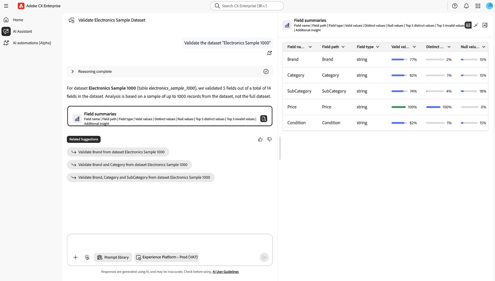
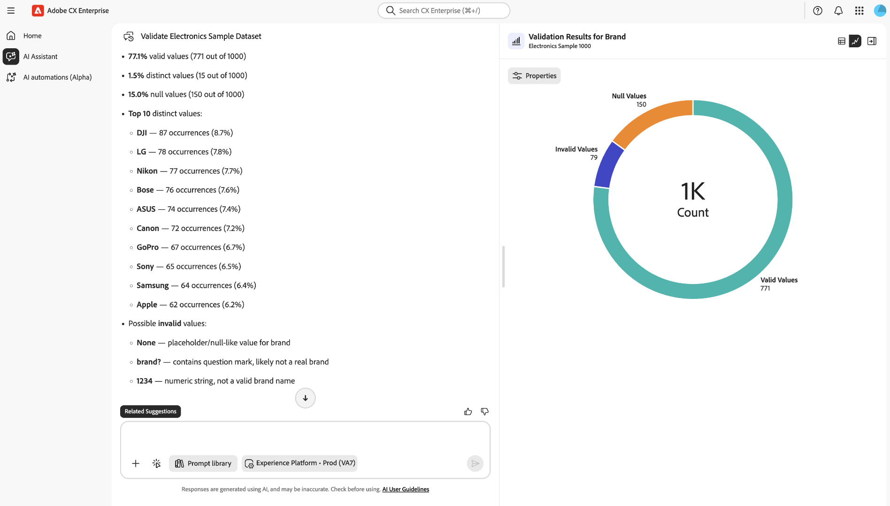

# Validar seus dados no Assistente de IA

Você pode usar o Assistente de IA para validar a qualidade dos dados de seus conjuntos de dados do Adobe Experience Platform. Desenvolvido pela Agent Orchestrator, o recurso de validação de dados pode executar validações estatísticas e semânticas em conjuntos de dados, analisar campos de conjuntos de dados, identificar problemas de qualidade de dados e retornar resumos de linguagem natural com insights acionáveis. Engenheiros, analistas e administradores de dados podem usar esse recurso por meio do Assistente de IA para executar avaliações rápidas da qualidade dos dados sem escrever consultas SQL ou navegar em hierarquias de esquema complexas.

Com a validação de dados habilitada pela Agent Orchestrator no Assistente de IA, você pode:

- Preencha as lacunas essenciais no processo de integração e no diagnóstico diário.
- Reduza o controle de qualidade manual em seus conjuntos de dados.
- Acelere o tempo de implantação de seus clientes.

Leia esta documentação para saber como validar seus dados no Assistente de IA.

>[!NOTE]
>
>O Assistente de IA é a interface conversacional para esse fluxo de trabalho. O Agent Orchestrator executa o raciocínio e coordena as etapas de validação nos bastidores.

## Casos de uso

| Caso de uso | Descrição |
| --- | --- |
| Nova implementação | Nesses cenários, você pode validar a identidade principal e os campos de evento para confirmar se os formatos e as taxas nulas parecem íntegros. |
| Problema de mapeamento suspeito | Nesses cenários, você pode validar um campo e inspecionar os valores principais e inválidos para confirmar se ele corresponde à semântica desejada. |
| Gestão contínua de dados | Nesses cenários, é possível executar a validação do conjunto de dados semanalmente em conjuntos de dados críticos para capturar regressões antecipadamente. |

## Guia da interface do usuário

Use o **Assistente de IA** no Adobe CX Enterprise para validar seus dados. O AI Assistant é a interface conversacional, enquanto o Agent Orchestrator coordena o fluxo de trabalho de validação nos bastidores. As etapas a seguir seguem as telas principais que você verá.

### Iniciar validação

Na navegação à esquerda, selecione **[!UICONTROL Assistente de IA]**. Em seguida, use o seletor de ambiente e escolha a organização ou sandbox da Experience Platform em que seu conjunto de dados está (por exemplo, **[!UICONTROL Experience Platform - Prod]**). No campo de prompt, digite uma solicitação de validação (por exemplo, pedir para validar um conjunto de dados por nome). Selecione **[!UICONTROL Enviar]** para enviar o prompt.

>[!TIP]
>
>É prática recomendada anexar os nomes do conjunto de dados à palavra &quot;conjunto de dados&quot; ao enviar uma consulta ao Assistente de IA. Por exemplo, sua consulta deve ser &quot;Validate the dataset Electronics Sample 1000&quot; em vez de &quot;Validate Electronics Sample 1000&quot;.

### Leia a tabela de resumo e campo do conjunto de dados

Permita que o Agent Orchestrator conclua a execução em breve (**Raciocínio concluído**). Quando a execução for concluída, leia o resumo do nome do conjunto de dados, quantos campos foram validados e o tamanho da amostra (normalmente até cerca de 1.000 linhas).

Use os **[!UICONTROL Resumos de campo]** para revisar o caminho, o tipo e os valores Válidos de cada campo (incluindo o indicador de validade). Além disso, você pode usar os ícones de tabela, gráfico ou documento no cartão para alterar a forma como os resultados são exibidos, se disponível.

Selecione **[!UICONTROL Mostrar todos os resultados]** quando precisar de colunas ou linhas adicionais além da primeira exibição.

### Trabalhar na exibição dividida

Na exibição expandida, use o layout dividido: estatísticas detalhadas e narrativa de um lado e o gráfico do outro.

- No lado da narrativa, revise a validade, os valores distintos, as taxas nulas, os valores distintos principais e todas as mensagens de valor inválido.
- No lado da visualização, use o gráfico para uma leitura rápida de valores válidos versus inválidos na amostra.

Use **[!UICONTROL Sugestões relacionadas]** ou o campo de prompt na parte inferior para validar outro campo, executar novamente o conjunto de dados ou continuar a conversa.

### Usar uma sugestão relacionada para um acompanhamento

Após uma resposta, encontre **[!UICONTROL Sugestões relacionadas]** abaixo da conversa. Selecione uma sugestão (por exemplo, validar um campo específico no mesmo conjunto de dados) para carregá-lo no campo de prompt. Ajuste o texto, se necessário, confirme o ambiente e selecione **[!UICONTROL Enviar]** para executar o acompanhamento.

### Validar no nível do campo

Abra um cartão de **[!UICONTROL Resultados da validação]** em nível de campo (por exemplo, após validar um único campo). Use os controles de exibição para alternar para **Gráfico** (ou outro modo de exibição) quando quiser um resumo visual em vez de uma tabela. Durante esta etapa, você pode selecionar **[!UICONTROL Propriedades]** para ver mais sobre o campo.

Selecione **[!UICONTROL Mostrar na exibição expandida]** para abrir uma exibição maior e mais detalhada da validação desse campo.

Por meio da exibição expandida, é possível exibir uma lista discriminada do campo inteiro, com base em uma amostra de até 1000 registros para o campo especificado. Você pode usar esse recurso para recuperar informações sobre valores válidos, distintos e nulos.

## Como a validação funciona

Quando você inicia uma validação no Assistente de IA, o Agent Orchestrator analisa uma amostra representativa do seu conjunto de dados, normalmente as ~1.000 linhas mais recentes, em vez de processar todo o histórico do conjunto de dados. O processo é estritamente somente leitura, garantindo que seus dados, esquemas e mapeamentos permaneçam inalterados. Os resultados da validação são consistentes, independentemente de como seus dados entram no Experience Platform, seja por meio de fontes, transmissão, uploads de arquivo, Preparo de dados ou outros métodos de assimilação. Os resultados servem como verificações indicativas para ajudar a identificar rapidamente os padrões de qualidade dos dados ou possíveis problemas, permitindo que você tome outras medidas (como explorar com o Serviço de consulta), se necessário. Essa abordagem baseada em Agent Orchestrator permite avaliações rápidas sem interromper a assimilação de dados ou afetar as cargas de trabalho de produção.

## Resultados da validação

Para cada campo validado, o Assistente de IA exibe os resultados gerados pelo fluxo de trabalho de validação, incluindo:

**Estatísticas básicas**

- Contagem total de linhas usada para a amostra
- nullCount (e, opcionalmente, % nulo)
- uniqueCount (quando disponível)
- Valores únicos principais (por exemplo, os 10 principais) e suas frequências

**Validação semântica**

- Lista de **valores inválidos suspeitos**
- Para cada valor inválido, uma **explicação** (por exemplo, &quot;formato de email não válido&quot;, &quot;carimbo de data/hora fora do intervalo esperado&quot;)

**Resumo da linguagem natural**

- Um breve resumo narrativo da qualidade do campo
- As próximas ações sugeridas, como &quot;revisar o mapeamento do campo X&quot;, &quot;considerar descartar o campo Y devido à alta taxa nula&quot; ou &quot;restringir a validação para o formato do email&quot;.

| Aspecto | Exemplo de saída |
| --- | --- |
| Integralidade | `nullCount = 9,532 (95.3%)` |
| Exclusividade | `uniqueCount = 3` |
| Valores principais | `"True" (255), "False" (243)` |
| Valores iniciais | `"abc@, reason: "not a valid email address"` |

## Tipos de validação

Há dois tipos principais de validação que podem ser executados com o Assistente de IA:

- **Validação de campo**: valide um campo específico em um conjunto de dados.
- **Validação do conjunto de dados**: valide até cinco (5) campos em um conjunto de dados.

>[!BEGINTABS]

>[!TAB Validação de campo]

Use a validação de campo no Assistente do AI para validar um campo específico em um determinado conjunto de dados. Essa habilidade de validação oferece o seguinte:

- Contagem nula e contagem de valor único.
- Principais valores únicos e suas frequências correspondentes.
- Validação semântica assistida por IA (capacidade de detectar valores inválidos com base nos metadados disponíveis e nos valores reais dos dados).

Exemplos de prompts para validação de campo incluem:

- Valide o campo de email no conjunto de dados Customers_2024.
- Validar o status do campo para o conjunto de dados customer_events_2024.
- Validar o campo person.address.city para o conjunto de dados Dados do cliente.

>[!TAB Validação do conjunto de dados]

Use a validação do conjunto de dados no Assistente de IA para validar conjuntos de dados inteiros, resumindo a qualidade geral e os principais problemas. Embora você possa fornecer esses campos explicitamente, a Agent Orchestrator também pode analisar o conjunto de dados e determinar automaticamente os campos mais relevantes. Essa habilidade fornece o mesmo tipo de informação que a validação de campo, mas através de vários campos direcionados. Você pode validar até cinco campos em um determinado conjunto de dados.

Exemplos de prompts para validação do conjunto de dados incluem:

- Validar o conjunto de dados Dados do cliente de 2024.
- Valide os campos email, telefone para Customers_2024.
- Resumir firstName, lastName, birthDate para Dados do cliente.
- Resuma o conjunto de dados 693012a4b8c98b09cea350bc.

>[!ENDTABS]

## Verificações executadas pela validação de dados

Os seguintes tipos de validação são executados para cada campo e conjunto de dados:

- **Verificações de integridade**: contagens e porcentagens nulas/ausentes.
- **Verificações de distribuição**: valores exclusivos principais e suas distribuições, detecção de alta cardinalidade.
- **Verificações semânticas em relação ao esquema**: usa o nome, o tipo e a descrição do campo XDM para descobrir a aparência &quot;válida&quot; e sinaliza anomalias.
- **Verificações com reconhecimento de tipo de dados** (quando aplicável):
   - Email: formato e plausibilidade do domínio
   - Telefone: preparação do formato (por exemplo, E.164)
   - Datas/carimbos de data e hora: integridade do formato básico (por exemplo, ISO-8601)
- **Verificações relacionadas à identidade** (futuras/estendidas): exclusividade dos campos de identidade candidatas ou chaves compostas.

Essas verificações combinam estatísticas determinísticas com validação semântica assistida por LLM para detectar valores que &quot;parecem errados&quot;, mesmo quando tecnicamente correspondem ao esquema.

## Limitações

Antes de validar seus dados, é importante estar ciente de algumas limitações principais. Essas restrições têm como objetivo equilibrar o desempenho com a funcionalidade e ajudarão a definir expectativas para os tipos de análise e insights que você pode esperar.

- **Somente amostragem**: a validação opera em uma amostra do conjunto de dados (normalmente, as últimas ~1.000 linhas) em vez de processar o conjunto de dados inteiro. As verificações completas do conjunto de dados não estão disponíveis.
- **Limite de contagem de campos**: ao validar um conjunto de dados, o agente analisa até cinco campos por solicitação. Você pode especificar esses campos ou permitir que o agente os selecione automaticamente.
- **Semântica probabilística**: a detecção de valores inválidos depende em parte de inferência baseada em LLM, que pode ocasionalmente perder erros sutis ou sinalizar valores de linha de borda.
- **Operação somente leitura**: o agente não faz nenhuma alteração em seus dados ou em seu esquema. Ele fornece insights e destaca possíveis problemas, mas não executa correções automáticas.

Se suas necessidades de validação forem mais exaustivas ou exigirem a aplicação de uma lógica de negócios complexa, considere complementar os resultados mostrados no Assistente de IA com ferramentas adicionais, como o Serviço de consulta ou validações de Preparo de dados.
