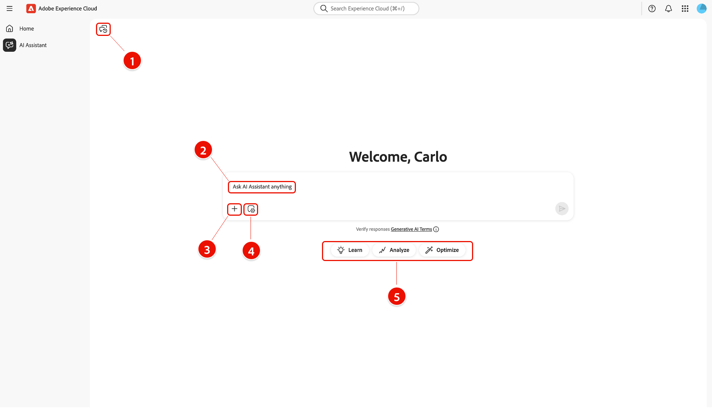
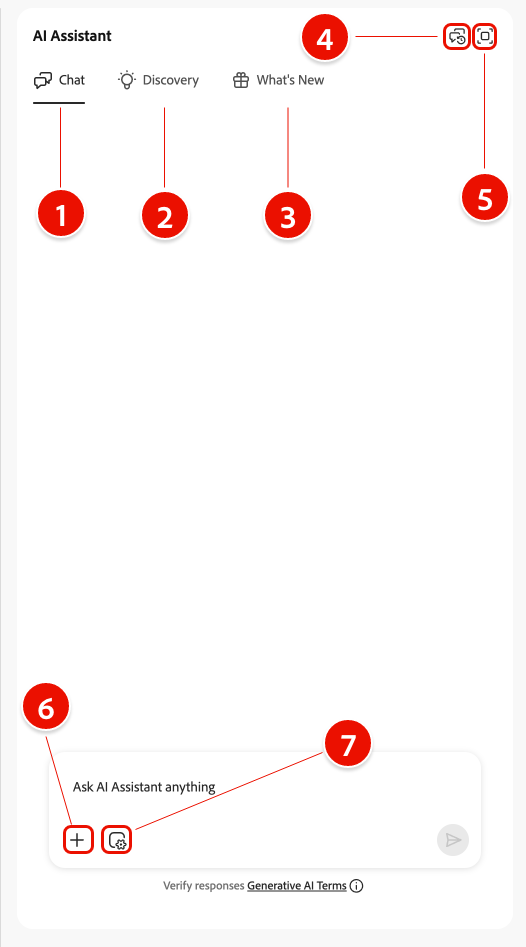
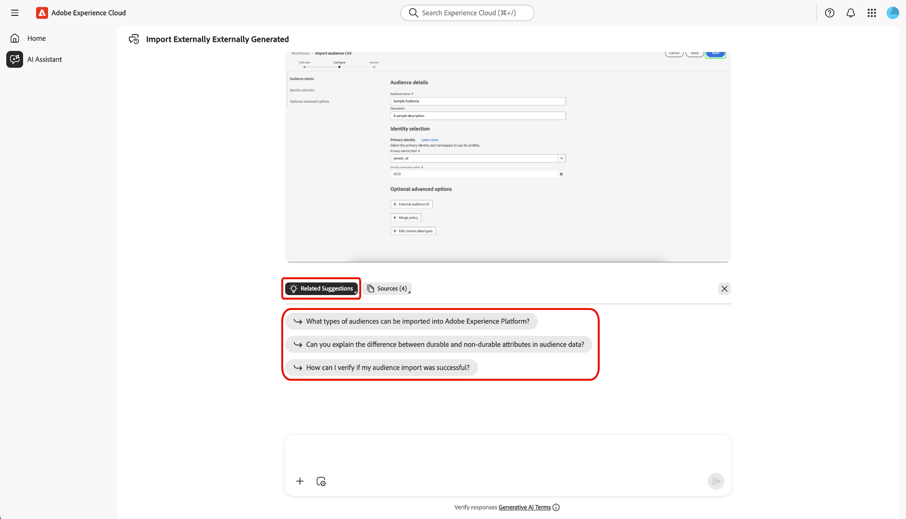
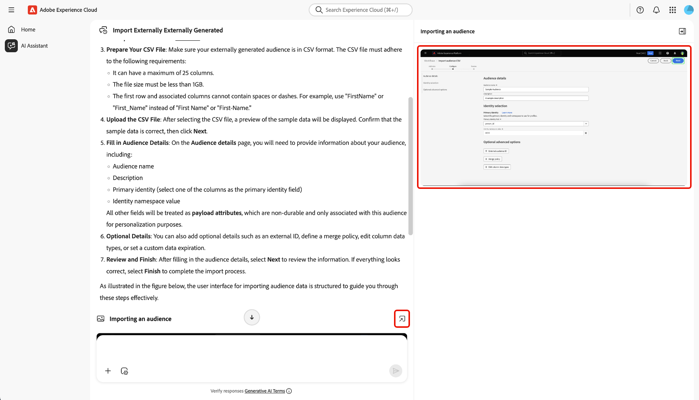
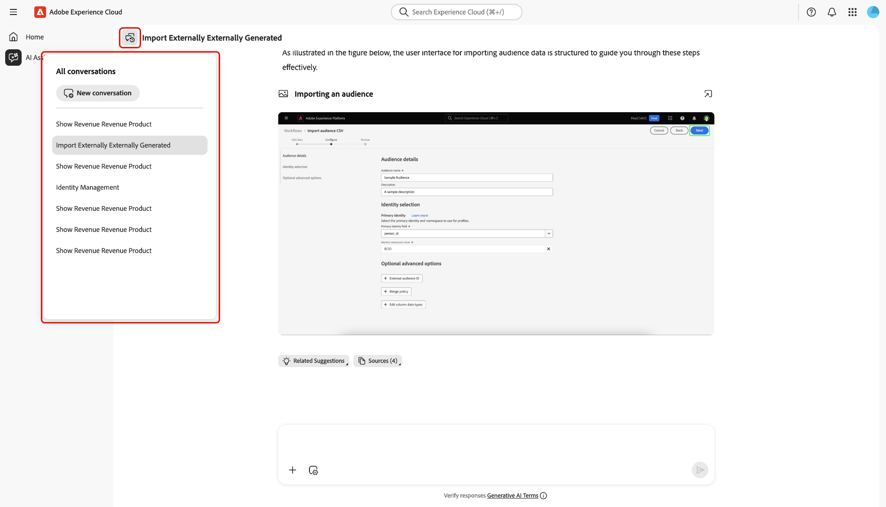

# Assistente de IA

O AI Assistant é uma ferramenta de IA conversacional e gerativa inteligente que impulsionará a produtividade e redefinirá o trabalho em aplicativos baseados em Adobe Experience Platform. Você pode usar o Assistente de IA para acessar os Agentes do Adobe Experience Platform e outros recursos de IA.

Leia este guia para saber como usar o Assistente de IA.

## Acessar o assistente do AI

Há várias maneiras de acessar o Assistente de IA.

Na interface da página inicial do Experience Cloud, selecione **[!UICONTROL Assistente de IA]** no menu de navegação esquerdo para iniciar uma exibição de tela inteira do Assistente de IA.

+++Selecione para exibir

+++

Você também pode iniciar o Assistente de IA nas home pages dos aplicativos da Experience Cloud, como Experience Platform, Adobe Journey Optimizer e Customer Journey Analytics. Navegue até a home page do seu produto e selecione o **ícone do Assistente de IA** no cabeçalho superior para iniciar o painel de chat do Assistente de IA no painel direito.

+++Selecione para exibir

+++

## Navegar pela interface do usuário do Assistente de IA

Leia esta seção para saber como navegar na interface do Assistente de IA.

### Exibição em tela inteira

A interface do Assistente de IA inclui vários elementos-chave para ajudá-lo a interagir com eficiência:

1. **[!UICONTROL Conversas]**: selecione o ícone **[!UICONTROL Conversas]** para iniciar uma nova conversa e acessar conversas recentes do seu histórico. Para obter mais informações, leia a seção sobre [conversas](#conversations).
2. **Caixa de entrada**: selecione a caixa de entrada para inserir perguntas e prompts para o Assistente de IA. Para obter mais informações, leia a seção sobre [recursos de entrada](#input-features).
3. **Preenchimento automático de dados e objetos**: - Selecione o ícone de adição para usar sugestão de dados e objetos e preenchimento automático. Quando selecionada, você pode usar uma janela pop-up para selecionar entidades sugeridas. Para obter mais informações, leia a seção sobre [preenchimento automático de dados e objetos](#autocomplete).
4. **Configuração de contexto**: - Selecione o ícone de Configuração de contexto para configurar fontes de informações para o Assistente de IA. Você pode usar essa ferramenta para configurar o aplicativo, a sandbox e a visualização de dados que o Assistente do AI faz referência para responder à sua consulta. Para obter mais informações, leia a seção sobre [configuração de contexto](#context-setting).
5. **Descoberta**: - Selecione **[!UICONTROL Aprender]**, **[!UICONTROL Analisar]** e **[!UICONTROL Otimizar]** para exibir exemplos de consultas que você pode usar para começar. Para obter mais informações, leia a seção sobre [prompts de descoberta](#discoverability-prompts).

### Visualização do trilho

A visualização do painel fornece acesso rápido a bate-papo, prompts de descoberta, atualizações, conversas e controles de interface em um painel compacto.

1. **[!UICONTROL Chat]**: selecione **[!UICONTROL Chat]** no cabeçalho para retornar à sua conversa no caso de você deixar para acessar elementos diferentes na interface.
1. **[!UICONTROL Descoberta]**: selecione **[!UICONTROL Descoberta]** para exibir uma lista de prompts do Assistente de IA organizados por categoria. Você pode usar esses prompts pré-configurados para preencher o bate-papo. Além disso, você pode ajustar os prompts sugeridos para atender ao seu caso de uso específico.
1. **[!UICONTROL Novidades]**: selecione **[!UICONTROL Novidades]** para exibir uma lista das atualizações mais recentes disponíveis para o Assistente de IA.
1. **[!UICONTROL Conversas]**: selecione o ícone **[!UICONTROL Conversas]** para iniciar uma nova conversa e acessar conversas recentes do seu histórico. Para obter mais informações, leia a seção sobre [conversas](#conversations).
1. **Modo de exibição de tela cheia**: selecione o ícone **[!UICONTROL Modo de exibição de tela cheia]** para alterar a interface do Assistente do AI do painel direito para o modo de tela cheia.
1. **Preenchimento automático de dados e objetos**: selecione o ícone de adição para usar sugestão de dados e objetos e preenchimento automático. Quando selecionada, você pode usar uma janela pop-up para selecionar entidades sugeridas. Para obter mais informações, leia a seção sobre [preenchimento automático de dados e objetos](#autocomplete).
1. **Configuração de contexto**: selecione o ícone de Configuração de contexto para configurar fontes de informações para o Assistente de IA. Você pode usar essa ferramenta para configurar o aplicativo, a sandbox e a visualização de dados que o Assistente do AI faz referência para responder à sua consulta. Para obter mais informações, leia a seção sobre [configuração de contexto](#context-setting).

## Guia da interface do assistente de IA

Esta seção fornece uma visão geral dos principais recursos e opções de navegação na interface do usuário do Assistente de IA. Ele explica como acessar o Assistente de IA, descreve o layout e os controles em exibições de tela cheia e painel e introduz ferramentas-chave, como conversas, recursos de entrada, preenchimento automático, configuração de contexto e prompts de descoberta. As seções a seguir oferecem orientação detalhada sobre como usar esses recursos para interagir com o Assistente de IA e aproveitar ao máximo sua experiência.

### Prompts de descoberta

Você pode usar o recurso de descoberta do Assistente do AI para exibir uma lista de assuntos gerais, agrupados em entidades, que o Assistente do AI suporta. Os prompts de descoberta são diferentes dependendo do seu ponto de partida.

>[!BEGINTABS]

>[!TAB Usar descoberta da exibição de tela inteira]

No modo de exibição de tela inteira, os prompts de descoberta são agrupados em três categorias: **[!UICONTROL Aprender]**, **[!UICONTROL Analisar]** e **[!UICONTROL Otimizar]**.

Para usar prompts de descoberta para avançar o conhecimento do produto, selecione **[!UICONTROL Aprender]** e, em seguida, selecione um prompt na janela suspensa que aparece.

>[!TAB Usar descoberta do modo de exibição de painel]

Selecione **[!UICONTROL Descoberta]** na exibição do painel para acessar uma lista extensa de prompts de descoberta que você pode usar para começar e preencher seu chat com o Assistente de IA.

>[!ENDTABS]

Selecione um prompt para preencher a caixa de entrada. Aqui, você pode editar o prompt para que se ajuste ao seu caso de uso específico. Quando estiver pronto, selecione o ícone enviar à direita para enviar sua consulta.

## Interação com respostas

### Verificar processo de raciocínio {#reasoning}

O Assistente de IA consulta sua base de conhecimento e calcula uma resposta. Após alguns momentos, o Assistente de IA retorna uma resposta, incluindo opções para aprofundar seu processo de raciocínio, sugestões relacionadas, fontes de informações e ferramentas de feedback.

Para entender melhor o processo de raciocínio subjacente, selecione **[!UICONTROL Raciocínio concluído]**.

A janela *[!UICONTROL Raciocínio concluído]* é expandida para exibir um resumo da sua solicitação e detalhes sobre como a resposta foi criada.

### Usar sugestões relacionadas

Em seguida, navegue até o final da resposta e selecione **[!UICONTROL Sugestões relacionadas]** para receber uma lista de prompts relacionados à sua consulta inicial. Você pode usar esses prompts para continuar sua conversa com o Assistente de IA.

### Exibir fontes

Para verificar a resposta do Assistente de IA, selecione **[!UICONTROL Fontes]** para exibir uma lista de fontes de informações às quais o Assistente de IA fez referência ao calcular sua resposta.

### Fornecer feedback

Você pode fornecer feedback sobre sua experiência com o Assistente de IA usando as opções fornecidas com a resposta.

Para fornecer feedback, selecione polegares para cima ou para baixo depois de receber uma resposta do Assistente de IA e, em seguida, insira seu feedback na caixa de texto fornecida.

>[!BEGINTABS]

>[!TAB Polegar para cima]

Selecione **[!UICONTROL Aumentar]** para fornecer feedback positivo. Opcionalmente, é possível selecionar em uma lista de comentários positivos ou usar a caixa de entrada para inserir seu próprio feedback específico.

+++Selecione para exibir

Você também pode selecionar **[!UICONTROL Feedback detalhado]** para detalhar seu feedback. Quando terminar, selecione **[!UICONTROL Enviar]**.

+++

>[!TAB Polegar para baixo]

Selecione **[!UICONTROL Polegar para baixo]** para fornecer feedback construtivo. Opcionalmente, é possível selecionar em uma lista de comentários construtivos ou usar a caixa de entrada para inserir seu próprio feedback específico.

+++Selecione para exibir

Da mesma forma, você também pode selecionar **[!UICONTROL Feedback detalhado]** para aprofundar seu feedback. Quando terminar, selecione **[!UICONTROL Enviar]**.

+++

>[!ENDTABS]

### Usar o recurso de divisão de visualização

Se a resposta do AI Assistant incluir uma imagem, você poderá selecionar o ícone de caminho para iniciar um modo de divisão de visualização. Isso permite ler toda a resposta do Assistente de IA com imagem contextual exibida à direita.

### Conversas

Você pode usar o painel *[!UICONTROL Todas as conversas]* para redefinir e rever conversas com o Assistente de IA. Selecione o ícone **[!UICONTROL Conversas]** para exibir a janela *[!UICONTROL Todas as conversas]*.

Para rever uma conversa anterior, selecione o tópico da conversa na lista fornecida.

Para iniciar uma nova conversa, selecione **[!UICONTROL Nova conversa]**.

### Configuração de contexto {#context-setting}

Use o recurso de configuração de contexto do Assistente de IA para configurar o **aplicativo**, a **sandbox** e a **exibição de dados** referenciados pelo Assistente de IA para responder à sua consulta. Para acessar a configuração de contexto, selecione o ícone **[!UICONTROL Configuração de contexto]** na caixa de entrada.

A janela pop-up *[!UICONTROL Resposta de...]* é exibida. Use esta janela para configurar as fontes de informações que deseja usar e selecione **[!UICONTROL Definir contexto]**.

| Fonte de informações | Descrição | Exemplos |
| --- | --- | --- |
| Aplicativo | O aplicativo do Experience Cloud ao qual sua consulta pertence. | Experience Platform, Journey Optimizer, Customer Journey Analytics etc. |
| Sandbox | A sandbox que contém o(s) conjunto(s) de dados ou as informações às quais sua consulta pertence. | Prod (VA7), Desenvolvimento |
| Exibição de dados | Quando você está usando o Assistente de IA com o Customer Journey Analytics, a configuração da exibição de dados ajuda a Data Insights Agent a entender: <ul><li>Quais conjuntos de dados consultar</li><li>Quais componentes de dados estão disponíveis</li><li>Como estruturar respostas sobre seus dados</li><li>Quais visualizações criar no Analysis Workspace</li></ul> |

### Preenchimento automático de dados e objetos

Você pode usar a função de preenchimento automático para receber uma lista de objetos de dados que existem na sandbox. Para usar o preenchimento automático, insira o ícone de adição (+) na consulta. Como alternativa, você também pode selecionar o ícone de adição (+) localizado na parte inferior da caixa de entrada de texto. Uma janela é exibida com uma lista de objetos de dados recomendados da sandbox.

### Verificar respostas

Há várias maneiras de verificar as respostas do Assistente de IA. Selecione **[!UICONTROL Termo de consulta correspondente a objetos]** para exibir um resumo dos termos na sua consulta que corresponderam a objetos específicos na sua organização.

Selecione **[!UICONTROL Veja aqui como obtive os resultados]** para ver uma explicação detalhada, passo a passo, de como o Assistente de IA chegou à sua resposta. Além disso, você também pode exibir a consulta SQL que foi executada para responder à sua pergunta. Esta consulta é somente leitura e não tem suporte para uso no Serviço de consulta.

### Configurar visualização de dados

Você pode usar os recursos de visualização de dados do Assistente de IA para entender melhor seus dados. Você também pode especificar o tipo de gráfico que deseja usar em sua consulta. Por exemplo, envie uma consulta que diga: **&quot;Mostrar lucro por nome de produto do mês passado (barra)&quot;** para receber um gráfico de barras de lucro do mês passado, organizado por nome de produto.

Em seguida, selecione **[!UICONTROL Propriedades]** para alterar o tipo de gráfico e configurar valores para os eixos X e Y.

O Assistente de IA suporta vários tipos de gráficos para visualização de dados. Você pode interagir com todos os tipos de gráfico, passando o cursor do mouse sobre os dados.

>[!BEGINTABS]

>[!TAB Linha]

Para exibir um gráfico de linhas, selecione **[!UICONTROL Propriedades]** e **[!UICONTROL Linha]**.

>[!TAB Área]

Para exibir um gráfico de área, selecione **[!UICONTROL Propriedades]** e **[!UICONTROL Área]**.

>[!TAB Dispersão]

Para exibir um gráfico de dispersão, selecione **[!UICONTROL Propriedades]** e **[!UICONTROL Dispersão]**.

>[!TAB Rosca]

Para exibir um gráfico de rosca, selecione **[!UICONTROL Propriedades]** e selecione **[!UICONTROL Rosca]**.

>[!ENDTABS]
